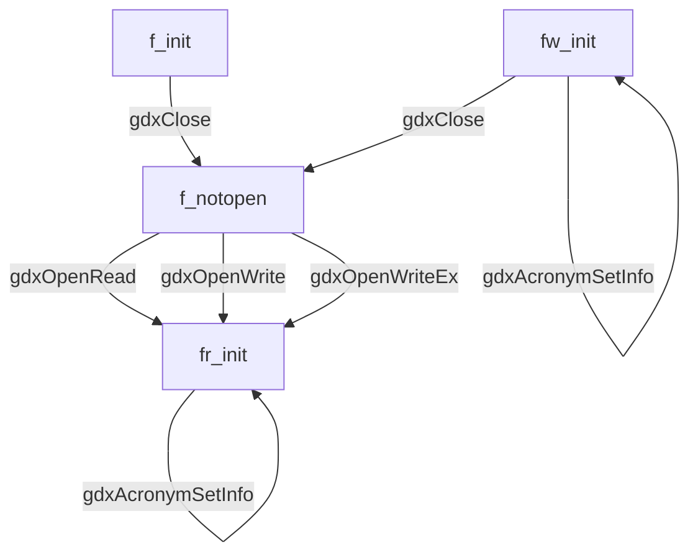
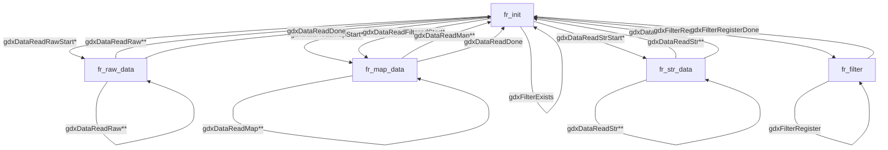
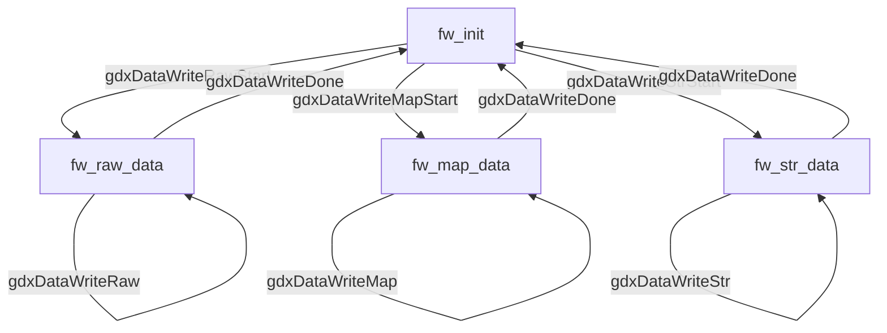
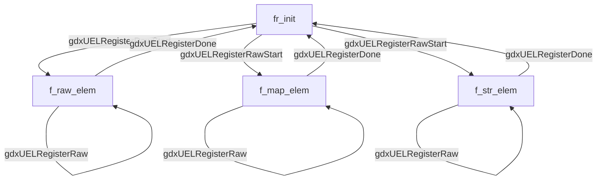

# GAMS Data eXchange (GDX)

<!-- skip doxygen begin -->

## Table of Contents

* [GAMS Data eXchange (GDX)](#gams-data-exchange-gdx)
    * [Basic information on GDX file format](#basic-information-on-gdx-file-format)
        * [Information contained inside a GDX file](#information-contained-inside-a-gdx-file)
        * [Features of the GDX API](#features-of-the-gdx-api)
    * [Setting up and building GDX](#setting-up-and-building-gdx)
        * [Accessing GDX from a custom application](#accessing-gdx-from-a-custom-application)
        * [Building GDX from source](#building-gdx-from-source)
    * [Reference documentation](#reference-documentation)
    * [Introduction into using GDX API](#introduction-into-using-gdx-api)
        * [Writing data to a GDX file](#writing-data-to-a-gdx-file)
        * [Writing data using strings](#writing-data-using-strings)
        * [Writing data using integers (raw)](#writing-data-using-integers-raw)
        * [Writing data using integers (mapped)](#writing-data-using-integers-mapped)
        * [Reading data from a GDX file](#reading-data-from-a-gdx-file)
        * [Reading data using strings](#reading-data-using-strings)
        * [Reading data using integers (raw)](#reading-data-using-integers-raw)
        * [Reading data using integers (Mapped)](#reading-data-using-integers-mapped)
        * [Reading data using a filter](#reading-data-using-a-filter)
        * [Dealing with acronyms](#dealing-with-acronyms)
    * [Functions by Category](#functions-by-category)
    * [Transition diagram](#transition-diagram)
        * [Diagram for general operations](#diagram-for-general-operations)
        * [Diagram for read operations](#diagram-for-read-operations)
        * [Diagram for write operations](#diagram-for-write-operations)
        * [Diagram for UEL operations](#diagram-for-uel-operations)
    * [Example programs](#example-programs)
        * [Example 1 (GAMS)](#example-1-gams)
        * [Example 2 (C)](#example-2-c)
        * [Example 3 (C++)](#example-3-c)
        * [Example 4 (VB.NET)](#example-4-vbnet)
        * [Example 6 (Python)](#example-6-python)
        * [Example 7 (C#)](#example-7-c)
        * [Example 8 (Java)](#example-8-java)

<!-- Created by https://github.com/ekalinin/github-markdown-toc -->
<!-- skip doxygen end -->

## Basic information on GDX file format

The [GAMS modeling language](https://www.gams.com/latest/docs/UG_MAIN.html#UG_Language_Environment) is a domain specific
language tailored towards mathematical optimization. The language reflects the basic building blocks (symbols) of an
algebraic optimization model:

- [Sets](https://www.gams.com/latest/docs/UG_SetDefinition.html),
- [parameters](https://www.gams.com/latest/docs/UG_Parameters.html),
- [scalars](https://www.gams.com/latest/docs/UG_DataEntry.html#UG_DataEntry_Scalars),
- [decision variables](https://www.gams.com/latest/docs/UG_Variables.html),
- and [equations](https://www.gams.com/latest/docs/UG_Equations.html).

While declaring the symbols in the GAMS language is rather straightforward and concise, defining their values (which
must be done prior to running the optimization for exogenous symbols like sets, parameters and scalars) might be
comparatively cumbersome. In many applications, the actual data for the symbols is also already stored in some other
location like a file or database. In order to have an efficient way to load data into a model, store the solution
results and in general exchange information with other applications, the
[GDX file format](https://www.gams.com/latest/docs/UG_GDX.html) was conceived.

### Information contained inside a GDX file

- Unique elements (strings used to identify set elements)
- Acronyms as shorthand names for specific numeric values
- Symbols
    - with their attributes...
        - Type: Set, Alias, Parameter, Scalar, Variable, Equation
        - Dimensionality
        - User info
        - Explanatory text
    - ...and data (records)

Records are mapping from the domain of the symbol to the value space with up to 5 fields (level, marginal, lower bound,
upper bound, scale)

The actual data might be stored verbatim or compressed (using zlib).

*Please note:* a GDX file does **not** store a model formulation or executable statements.

### Features of the GDX API

For efficiency reasons (both read/write-speeds and disk usage) the GDX format is a binary format that cannot be easily
processed using a text editor. Hence, looking at the contents of a GDX file is ideally done via a graphical user
interface
like the GDX viewer included in GAMS Studio or the `gdxdump` console utility included in the GAMS distribution. In order
to write conversion utilities between GDX and various other data file formats, an API is needed. This API has the
following features:

- Reading list of symbols and UELs
- Reading data from a symbol (metadata, records)
- Writing a new symbol (metadata, records)
- Bindings to multiple languages

The GDX API is very powerful with fine-grained control and is also used at GAMS internally.

## Setting up and building GDX

### Accessing GDX from a custom application

The GDX API can be directly accessed from C/C++ via the library contained in this repository. Although there is a main
GDX object for representing a file in this interface, it is mostly procedural and offers many functions operating on
elementary data types instead of a sophisticated class hierarchy.

For an easier to use object-oriented interface GAMS offers wrappers for multiple programming languages including:

- [C++](https://www.gams.com/latest/docs/API_CPP_OVERVIEW.html) with source code available on
  [GitHub](https://git.gams.com/devel/gams-cpp)
- [.NET](https://www.gams.com/latest/docs/apis/dotnet/DOTNET_OVERVIEW.html) (Visual Basic, C#)
- [Java](https://www.gams.com/latest/docs/API_JAVA_OVERVIEW.html)
- [Python](https://www.gams.com/latest/docs/API_PY_CONTROL.html)

Even more abstraction is offered by the GAMS Transfer libraries for
[Python](https://www.gams.com/latest/docs/API_PY_GAMSTRANSFER.html) and
[R](https://transfer-r.readthedocs.io/en/stable).

### Building GDX from source

The GDX library is written in C++17 and built via [CMake](https://cmake.org/).

The fastest way to build the GDX library (static and dynamic) locally is by running the following spells:
```
git clone https://github.com/GAMS-dev/gdx.git
cd gdx
git clone https://github.com/madler/zlib zlib
cmake -DNO_TESTS=ON -DNO_EXAMPLES=ON .
cmake --build .
```
Running this on Linux creates the dynamic library `libgdxcclib64.so` and the static library `libgdx-static.a`.

This repository contains a GitLab CI YAML that describes a pipeline which

- builds GDX for all supported platforms (Windows, macOS, Linux) with Doxygen documentation, libraries, and examples,
- runs its unit test suite,
- checks for memory leaks with [valgrind memcheck](https://valgrind.org/docs/manual/mc-manual.html),
- and checks for performance regressions against GAMS 43 legacy Delphi GDX library.

Please run

```
git clone https://github.com/madler/zlib zlib
```

inside the root-directory of the `gdx`-repository to make the zlib compression library available.

[doctest](https://github.com/doctest/doctest) and [apigenerator](https://github.com/GAMS-dev/apigenerator) are included
in this repo (as file and submodule respectively).

**Dependencies**:

- [zlib](https://github.com/madler/zlib) (compression library)
- [doctest](https://github.com/doctest/doctest)

**Build tools**:

- [GAMS API generator](https://github.com/GAMS-dev/apigenerator) (language binding/wrapper tool)
- [CMake](https://cmake.org/) (build system)
- C++17 compiler (e.g. [GCC](https://gcc.gnu.org/), [clang](https://clang.llvm.org/),
  [MSVC](https://visualstudio.microsoft.com/),
  [Intel C++](https://www.intel.com/content/www/us/en/developer/tools/oneapi/dpc-compiler.html#gs.12zqsa))

## Reference documentation

A full detailed Doxygen-generated API reference is
available [here](https://gams-dev.github.io/gdx/classgdx_1_1TGXFileObj.html).

## Introduction into using GDX API

This document describes the Application Programmers Interface (API) for the GDX library. The GDX library is used to read
or write GDX files. A GDX file is a file that stores the values of one or more GAMS symbols such as sets, parameters,
variables, and equations. GDX files can be used to prepare data for a GAMS model, present results of a GAMS model, store
results of the same model using different parameters etc. A GDX file does not store a model formulation or executable
statements.

GDX files are binary files that are portable between different platforms. They are written using the byte ordering
native to the hardware platform they are created on, but can be read on a platform using a different byte ordering.

To read or write data, we need to be able to reference the set elements used to represent the index space for symbols
with one or more dimensions. The API provides three interface models for this purpose:

1. The **String** based interface. An `n` dimensional element is represented as an array of strings.
2. The **Raw** integer interface. An `n` dimensional element is represented as an array of integers. The integer used
   for
   each index position is obtained from the API after registering the string representation with the API.
3. The **Mapped** integer interface. An `n` dimensional element is represented as an array of integers. The integer used
   for each index position is defined by the user. Before such an element can be used, its value and string has to be
   registered.

### Writing data to a GDX file

Creating a GDX file and writing one or more symbols to the file requires a number of steps:

1. Make sure the GDX library is available
2. Open a file for writing
3. Register unique elements
4. Start writing a symbol
5. Write the data
6. Finish writing for the symbol
7. Optional: share acronyms
8. Close the file
9. Unload the GDX library

Steps 3 - 6 can be repeated to write any number of symbols to the file. Once a symbol has been written to the file, it
cannot be replaced. Currently, there are no facilities to overwrite a symbol or append data to an existing file.

The following sections illustrate the basic steps for each type of interface. The method of writing (string, raw, or
mapped) can be selected for each symbol; it cannot be changed while writing a symbol.

Most code samples reference the following auxiliary function `ReportGDXError` to report the latest GDX error when the
most recent call to the GDX API has reported a problem (usually by returning `false`).

```cpp
void ReportGDXError(TGXFileObj &gdx) {
  std::array<char, GMS_SSSIZE> S;
  std::cout << "**** Fatal GDX Error" << std::endl;
  gdx.gdxErrorStr(gdx.gdxGetLastError(), S.data());
  std::cout << "**** " << S.data() << std::endl;
  exit(1);
}
```

### Writing data using strings

The String based interface is suitable when we want to use a string based index and do not want to maintain a mapping
from strings to integers.

Before writing data using a string based interface we can register strings for the unique elements, but this step is
*optional*. The only reason to register the strings beforehand is to enter the strings in a given order which may have
advantages later in the modelling stage.

```cpp
if(!gdx.gdxDataWriteStrStart("Demand","Demand data",1,dt_par,0))
   ReportGDXError();

IndxS[0] = "New-York";
Values[0] = 324.0;
gdx.gdxDataWriteStr(IndxS,Values);

IndxS[0] = "Chicago";
Values[0] = 299.0;
gdx.gdxDataWriteStr(IndxS,Values);

if(!gdx.gdxDataWriteDone())
   ReportGDXError();
```

In this example we write two records for a parameter that has a dimension of one.

### Writing data using integers (raw)

The Raw interface is suitable when we want to manage our own list of unique elements, and use an integer based index.
The Raw interface assumes that the integers assigned to the strings range from one to the number of strings registered.

Before we can write data using the Raw interface, we have to register the strings for the unique elements. The GDX
routines will assign an integer to the string that increases by one for every string registered.

```cpp
if(!gdx.gdxUELRegisterRawStart())
   ReportGDXError();
gdx.gdxUELRegisterRaw("New-York");
gdx.gdxUELRegisterRaw("Chicago");
if(!gdx.gdxUELRegisterDone())
   ReportGDXError();

if(!gdx.gdxDataWriteRawStart("Demand","Demand data",1,dt_par,0))
   ReportGDXError();

IndxI[0] = 1;
Values[0] = 324.0;
gdx.gdxDataWriteRaw(IndxI,Values);

IndxI[0] = 2;
Values[0] = 299.0;
gdx.gdxDataWriteRaw(IndxI,Values);

if(!gdx.gdxDataWriteDone())
    ReportGDXError();
```

### Writing data using integers (mapped)

The Mapped interface is suitable when we want to manage our *own* list of unique elements, and use an integer based
index. The mapped interface lets us select our own mapping between strings for the unique elements and their integer
equivalent. The integers assigned to the unique elements should be greater equal one, and be unique for each element.

Before we can write data using the Mapped interface, we have to register the strings for the unique elements.

```cpp
if(!gdx.gdxUELRegisterMapStart())
   ReportGDXError();
gdx.gdxUELRegisterMap(1000,"New-York");
gdx.gdxUELRegisterMap(2000,"Chicago");
if(!gdx.gdxUELRegisterDone())
   ReportGDXError();

if(!gdx.gdxDataWriteMapStart("Demand","Demand data",1,dt_par,0))
   ReportGDXError();

IndxI[0] = 1000;
Values[0] = 324.0;
gdx.gdxDataWriteRaw(IndxI,Values);

IndxI[0] = 2000;
Values[0] = 299.0;
gdx.gdxDataWriteRaw(IndxS,Values);

if(!gdx.gdxDataWriteDone())
    ReportGDXError();
```

In this example we register two unique elements, and write a parameter of dimension one.

### Reading data from a GDX file

Opening an existing GDX file and reading one or more symbols from the file requires a number of steps:

1. Make sure the GDX library is available
2. Open a file for reading
3. Optional: share acronyms
4. Register unique elements
5. Start reading a symbol
6. Read the data
7. Finish reading for the symbol
8. Close the file
9. Unload the GDX library

Steps 3 - 6 can be repeated to read any number of symbols from the file.

The following sections illustrate the basic steps for each type of interface. The method of writing (string, raw or
mapped) can be selected for each symbol; it cannot be changed while writing a symbol.

### Reading data using strings

Reading data using strings does not require any unique element registration.

```cpp
if(!gdx.gdxFindSymbol("x",SyNr)) {
   std::cout << "**** Could not find symbol X" << std::endl;
   exit(1);
}

gdx.gdxSymbolInfo(SyNr,SyName,SyDim,SyTyp);
if(SyDim != 1 || SyTyp != dt_par) {
   std::cout << "**** X is not a one dimensional parameter" << std::endl;
   exit(1);
}

if(!gdx.gdxDataReadStrStart(SyNr,NrRecs))
   ReportGDXError();

std::cout << "Parameter X has " << NrRecs << " records" << std::endl;

while(gdx.gdxDataReadStr(IndxS,Values,N))
   std::cout << "Record = " << IndxS[0] << " " << Values[0] << '\n';

if(!gdx.gdxDataReadDone())
   ReportGDXError();
```

In this example we find the symbol by its name, and before reading the data we verify that the symbol represents a one
dimensional parameter.

### Reading data using integers (raw)

Reading data using integers in Raw mode does not require the registration of unique elements. The read routine returns
an integer for which we can find the string representation.

```cpp
if(!gdx.gdxFindSymbol("x",SyNr) {
   std::cout << "**** Could not find symbol X" << std::endl;
   exit(1);
}

gdx.gdxSymbolInfo(SyNr,SyName,SyDim,SyTyp);
if(SyDim != 1 || SyTyp != dt_par) {
   std::cout << "**** X is not a one dimensional parameter" << std::endl;
   exit(1);
}

if(!gdx.gdxDataReadRawStart(SyNr,NrRecs))
   ReportGDXError();

std::cout << "Parameter X has ",NrRecs," records");

while(gdx.gdxDataReadRaw(IndxI,Values,N)) {
   std::cout << "Record = " << IndxI[0] << " = " << Values[0];
   gdx.gdxUMUelGet(IndxI[0],S,UsrMap);
   std::cout << " with string = " << S << '\n';
}

if(!gdx.gdxDataReadDone())
   ReportGDXError();
```

In this example we find the symbol by its name, and before reading the data we verify that the symbol represents a one
dimensional parameter. When reading the data, we get a unique element as an integer. The integer value is used to get
the corresponding string for the unique element.

### Reading data using integers (Mapped)

Reading data using integers in Mapped mode requires the registration of unique elements. The read routine returns an
integer for which we can find the string representation.

When the gdx file contains data elements that we never registered, the read function will not return these elements,
they will be added to an internal list of error records instead.

```cpp
if(!gdx.gdxUELRegisterMapStart())
   ReportGDXError();
gdx.gdxUELRegisterMap(1000,"New-York");
gdx.gdxUELRegisterMap(2000,"Chicago");
if(!gdx.gdxUELRegisterDone())
   ReportGDXError();

if(!gdx.gdxFindSymbol("x",SyNr)) {
   std::cout << "**** Could not find symbol X" << std::endl;
   exit(1);
}

gdx.gdxSymbolInfo(SyNr,SyName,SyDim,SyTyp);
if(SyDim != 1 || SyTyp != dt_par) {
   std::cout << "**** X is not a one dimensional parameter" << std::endl;
   exit(1);
}

if(!gdx.gdxDataReadMapStart(SyNr,NrRecs))
   ReportGDXError();

std::cout << "Parameter X has " << NrRecs << " records" << std::endl;

for(int N{}; N<NrRecs; N++) {
   if(gdx.gdxDataReadMap(N,IndxI,Values,N)) {
      std::cout << "Record = " << N << "  " << IndxI[0] << " = " << Values[0];
      GetUEL(gdx,IndxI[0],S);
      std::cout << " with string = " << S << '\n';
   }
}

if(!gdx.gdxDataReadDone())
   ReportGDXError();

NrRecs = gdx.gdxDataErrorCount();
if(NrRecs > 0)
   std::cout << NrRecs << " records were skipped" << std::endl;
```

In this example we register a few unique elements using our \own integer values. After verifying that we can find the
symbol and that the symbol represents a one dimensional parameter we can read the data. The index for the parameter is
returned using the integers we used when registering our elements. When we read the records in sequence, the index
returned will be sorted with the first index position the most significant.

After reading the data, we print the number of records that were skipped in the read routine.

### Reading data using a filter

Reading data using a filter allows us to control the action for every index position. The type of action is specified
using action codes and needs to be specified for every index position. The actual reading of the records is done with
the gdxDataReadMap function.

| Action code        | Description                                                                                                                                                                                                                                                                                                             |
|--------------------|-------------------------------------------------------------------------------------------------------------------------------------------------------------------------------------------------------------------------------------------------------------------------------------------------------------------------|
| UnMapped (-2)      | No mapping is performed; the value of the unique element is the value as stored in the GDX file. Use gdxUMUelGet to get the string representation.                                                                                                                                                                      |
| Checked (0)        | Map the unique element value to the user defined value. Use gdxGetUEL to get the string representation. If a user mapping was not defined for this element,<br />the record is flagged as an error record and the record will be skipped.                                                                               |
| Expand (-1)        | Map the unique element value to the user defined value. Use gdxGetUEL to get the string representation. If a user  mapping was not defined for this element, define a user mapping automatically using the next higher user map value.                                                                                  |
| Filter number (>0) | Map the unique element value to the user defined value. Use gdxGetUEL to get the string representation. If the element is not enabled in the filter for this index position, the record is flagged as an error record and it will be skipped. The filter number is specified using the gdxFilterRegisterStart function. |                                                                                         

Referring to the following GAMS fragment, we want to read the parameter `A`. The set `I` is the domain for the first
index; there is no domain for the second index position:

```
Set I /.../;
Parameter A(I,*);
```

Assuming we have read set `I` already, the following code snapshot illustrates how to read parameter `A`.

```cpp
// We wish to only read the values of A when the first label is either "New-York" or "Chicago"
// For this, we assign a unique value to each one of the label, here we choose 1000 and 2000
// Then, we register a filter with a unique ID, here 123.
// Note that a filter ID cannot be reused. The filter is immutable after its creation
gdx.gdxUELRegisterMapStart();
gdx.gdxUELRegisterMap( 1000, "New-York" );
gdx.gdxUELRegisterMap( 2000, "Chicago" );
gdx.gdxUELRegisterDone();
// Register the filter for set I; reference this filter with integer 123 (filter number)
if(!gdx.gdxFilterRegisterStart(123))
   ReportGDXError();
gdx.gdxFilterRegister(1000);
gdx.gdxFilterRegister(2000);
if(!gdx.gdxFilterRegisterDone())
   ReportGDXError();

// set the filter actions
std::array filterAction {
   123, //filter for I
   gdx::DOMC_EXPAND // expand (=-1)
};

// Remember highest mapped value in variable LastMapped
int NrUnMapped, LastMapped;
gdx.gdxUMUelInfo(NrUnMapped, LastMapped);

// Read parameter A as a 2 dimensional parameter
int SyNr;
if(!gdx.gdxFindSymbol("A", SyNr) {
   std::cout << "**** Could not find symbol A" << std::endl;
   exit(1);
}

std::array<char, GMS_SSSIZE> SyName;
int SyDim, SyTyp;
gdx.gdxSymbolInfo(SyNr, SyName.data(), SyDim, SyTyp);
if(SyDim != 2 || SyTyp != dt_par) {
   std::cout << "**** A is not a two dimensional parameter" << std::endl;
   exit(1);
}

int NrRecs;
if(!gdx.gdxDataReadFilteredStart(SyNr, filterAction.data(), NrRecs));
   ReportGDXError();
   
int DimFrst;
for(int N{1}; N<=NrRecs; N++) {
   if(gdx.gdxDataReadMap(N, IndxI, Values, DimFrst)) {
      // do something to process the record read (index, values)
   }
}

if(!gdx.gdxDataReadDone()
   ReportGDXError();

// see if there are new unique elements
int NewLastMapped;
gdx.gdxUMUelInfo(NrUnMapped, NewLastMapped);
if(NewLastMapped > LastMapped) {
   for(int N{LastMapped + 1}; N<=NewLastMapped; N++) {
      std::array<char, GMS_SSSIZE> S {};
      gdx.gdxGetUel(N,S.data());
      std::cout << "New element " << N << " = " << S.data() << '\n';
   }
}
```

A runnable version of this example can be found in the unit test suite under `/src/tests/gdxtests.cpp` as test
case with the name "Test filter example from README".

### Dealing with acronyms

In GAMS we can use acronyms in places where we can use a floating point number as in the following example:

```
set i /i1*i5/;
acronym acro1, acro2;
parameter A(i) /i1=1, i2=acro1, i3=3, i4=acro2, i5=5/;
display A;
```

The result of the display statement looks like:

```
----      4 PARAMETER A

i1 1.000,    i2 acro1,    i3 3.000,    i4 acro2,    i5 5.000
```

As we write data to a GDX file, the system keeps track which acronyms were used in the
data written. Before we close the GDX file, we share the identifiers
used for each acronym used. When reading a GDX file, we share all acronym identifiers
and their corresponding index before reading any data. Doing so will replace the
acronym indices stored in the GDX file by the one we provide.

The example below illustrates these steps.

```cpp
TGXFileObj gdx;
TgdxUELIndex UELS;
TgdxValues Vals;
int FDim, N, NrRecs, ErrNr, acrindx;
std::array<char, GMS_SSIZE> ErrMsg, acrtext, acrname;
//Check the library
if(!gdxGetReadyX(ErrMsg)) {
   std::cout << "Error loading GDX library, msg = " << ErrMsg << std::endl;
   exit(1);
}
//Create GDX object and open file for writing
gdx.gdxCreateX( ErrMsg);
gdx.gdxOpenWriteEx( "test.gdx", "testing", 0, ErrNr);

//register some unique elements
gdx.gdxUELRegisterRawStart();
for(int N{}; N<5; N++)
   gdx.gdxUELRegisterRaw( "uel" + std::to_string(N));
gdx.gdxUELRegisterDone();

//write a parameter with two acronyms
gdx.gdxDataWriteRawStart( "symb1", "text for symb1", 1, dt_par, 0);
for(int N{}; N<5; N++) {
   UELS[0] = N;
   Vals[vallevel] = (N == 1 || N == 3) ? gdx.gdxAcronymValue( N) : N;
   gdx.gdxDataWriteRaw( UELS, Vals);
}
gdx.gdxDataWriteDone();

//provide the names for the acronyms used
for(int N{}; N<gdx.gdxAcronymCount(); N++) {
   gdx.gdxAcronymGetInfo( N, acrname, acrtext, acrindx);
   if(acrindx == 2)
      gdx.gdxAcronymSetInfo( N, "acro1", "Some text for acro1", acrindx)
   else if(acrindx == 4)
      gdx.gdxAcronymSetInfo( N, "acro2", "Some text for acro2", acrindx)
}

//final check for errors before we close the file
N = gdx.gdxClose();
if(N) {
   gdxErrorStr(Nil, N, ErrMsg);
   std::cout << "Error writing file = " << ErrMsg << std::endl;
   exit(1);
}
gdx.gdxFree();

//open the file we just created
gdx.gdxCreateX( ErrMsg);
gdx.gdxOpenRead( "test.gdx", ErrNr);
if(ErrNr) {
   std::cout << "Error opening file, nr = " << ErrNr << std::endl;
   exit(1);
}

//give acronym indices using the name of the acronym
gdx.gdxAcronymSetInfo( 1, "acro1", "", 1000);
gdx.gdxAcronymSetInfo( 2, "acro2", "", 1001);

//read the parameter
gdx.gdxDataReadRawStart( 1, NrRecs);
while(gdx.gdxDataReadRaw( UELs, Vals, FDim)) {
   N = gdx.gdxAcronymIndex( Vals[vallevel]);
   if(!N) std::cout << Vals[vallevel])
   else std::cout << "Acronym: index = " << N << '\n';
}
gdx.gdxDataReadDone();

ErrNr = gdx.gdxClose();
//final error check before closing the file
if(ErrNr) {
   gdxErrorStr(nil, ErrNr, ErrMsg);
   std::cout << "Error reading file = ", ErrMsg);
   exit(1);
}
gdx.gdxFree();
```

## Functions by Category

The following table organizes the functions by category:

| Category            | Functions                                                                                                                                                                                     |
|---------------------|-----------------------------------------------------------------------------------------------------------------------------------------------------------------------------------------------|
| File (Open/Close)   | gdxOpenRead gdxOpenWrite gdxClose                                                                                                                                                             |
| System/Symbol       | gdxSystemInfo gdxSymbolInfo gdxSymbolInfoX                                                                                                                                                    | 
| Information         | gdxFindSymbol gdxGetUEL                                                                                                                                                                       |
| Unique elements     | gdxUELRegisterRawStart gdxUELRegisterMapStart gdxUELRegisterStrStart gdxUELRegisterRaw gdxUELRegisterMap gdxUELRegisterStr gdxUELRegisterDone gdxGetUEL gdxUMUelInfo gdxUMUelGet gdxUMFindUEL |
| Write Data          | gdxDataWriteRawStart gdxDataWriteMapStart gdxDataWriteStrStart gdxDataWriteRaw gdxDataWriteMap gdxDataWriteStr gdxDataWriteDone                                                               |
| Read Data           | gdxDataReadRawStart gdxDataReadMapStart gdxDataReadStrStart gdxDataReadRaw gdxDataReadMap gdxDataReadStr gdxDataReadFilteredStart gdxDataReadDone gdxDataErrorCount gdxDataErrorRecord        |
| Text for UELs       | gdxAddSetText gdxSetTextNodeNr gdxGetElemText gdxSetHasText                                                                                                                                   |
| Filters             | gdxFilterRegisterStart gdxFilterRegister gdxFilterRegisterDone gdxFilterExists                                                                                                                |
| Special values      | gdxResetSpecialValues gdxSetSpecialValues gdxGetSpecialValues gdxMapValue                                                                                                                     |
| Errors              | gdxGetLastError gdxErrorCount gdxErrorStr                                                                                                                                                     |
| Version/Information | gdxSetTraceLevel gdxFileVersion gdxGetDLLVersion                                                                                                                                              |
| Longest symbol UEL  | gdxSymbMaxLength gdxUELMaxLength gdxSymbIndxMaxLength                                                                                                                                         |
| Acronyms            | gdxAcronymIndex gdxAcronymValue gdxAcronymCount gdxAcronymGetInfo gdxAcronymSetInfo                                                                                                           |

<!-- skip doxygen begin -->

## Transition diagram

Some GDX operations only make sense after running other routines for preparation beforehand. For example, writing
records
to a symbol in raw mode can only be done after the symbol has been "opened" for writing in raw mode. Hence, the GDX
operations
follow a state machine like logic that prevents the user from executing operations that are not sensible in the current
state
of the GDX object. The routines documented below follow certain input / output state transitions. Routines not
documented
below have no special state requirements.

### Diagram for general operations



### Diagram for read operations



- `*` denotes symbol having data. Transition to `fr_init` if the symbol is empty.
- `**` stay in `fr_{raw,map,str}_data` iff. there are more records to read, move to `fr_init` otherwise.

### Diagram for write operations



### Diagram for UEL operations



<!-- skip doxygen end -->

## Example programs

### Example 1 (GAMS)

In this modified version of the trnsport.gms model, we use an external program to generate data for the demand
parameter. After we solve the model, we write the solution to a GDX file, and call the external program again to read
the variable from the GDX file.

```
$Title trnsport model using gdx files
$EOLCOM //
  Sets
       i   canning plants   / seattle, san-diego /
       j   markets          / new-york, chicago, topeka / ;

  Parameter
       a(i)  capacity of plant i in cases
         /    seattle     350
              san-diego   600  /

       b(j)  demand at market j in cases ;

  Table d(i,j)  distance in thousands of miles
                    new-york       chicago      topeka
      seattle          2.5           1.7          1.8
      san-diego        2.5           1.8          1.4  ;

  Scalar f  freight in dollars per case per thousand miles  /90/ ;

  Parameter c(i,j)  transport cost in thousands of dollars per case ;

            c(i,j) = f * d(i,j) / 1000 ;

  Variables
       x(i,j)  shipment quantities in cases
       z       total transportation costs in thousands of dollars ;

  Positive Variable x ;

  Equations
       cost        define objective function
       supply(i)   observe supply limit at plant i
       demand(j)   satisfy demand at market j ;

// These lines execute during the compilation phase
// The GAMS system directory is passed the the program so it knows where
// to look for the gdxcclib library

$call 'gdxexdp.exe %gams.sysdir%'      // create demand data
$GDXIN demanddata.gdx                  // open data file
$LOAD  b=demand                        // load parameter b (named 'demand' in file)
$GDXIN                                 // close data file

  cost ..        z  =e=  sum((i,j), c(i,j)*x(i,j)) ;

  supply(i) ..   sum(j, x(i,j))  =l=  a(i) ;

  demand(j) ..   sum(i, x(i,j))  =g=  b(j) ;

  Model transport /all/ ;

  Solve transport using lp minimizing z ;

  Display b,x.l, x.m ;

// These lines execute during the execution phase
execute_unload 'results.gdx',x;                     // write variable x to the gdx file
execute 'gdxexdp.exe %gams.sysdir% results.gdx'; // do something with the solution
```

### Example 2 (C)

```c
/*
  Use this command to compile the example:
  cl gdxdumpc.c ../../gmstest/apifiles/C/api/gdxcc.c ../../gmstest/apifiles/C/api/gclgms.c -I../../gmstest/apifiles/C/api/
*/

#include <stdio.h>
#include <string.h>
#include "gdxcc.h"
#include "gclgms.h"

char *val2str(gdxHandle_t Tptr, double val, char *s) {

  int sv;

  if (gdxAcronymName(Tptr, val, s)) {
    return s;
  } else {
    gdxMapValue(Tptr, val, &sv);
    if (sv_normal != sv)
      sprintf(s,"%s", gmsSVText[sv]);
    else
      sprintf(s,"%g", val);
    return s;
  }
}

int main (int argc, char *argv[]) {

  int rc,i,j,NrSy,NrUel,ADim,ACount,AUser,AUser2,NRec,FDim,IDum, BadUels=0;
  int ATyp, ATyp2;
  char
    msg[GMS_SSSIZE],
    FileVersion[GMS_SSSIZE], FileProducer[GMS_SSSIZE],
    sName[GMS_SSSIZE], sName2[GMS_SSSIZE], sText[GMS_SSSIZE], UelName[GMS_SSSIZE];

  gdxHandle_t Tptr=NULL;
  char DomainIDs[GMS_MAX_INDEX_DIM][GMS_SSSIZE];
  char *DP[GMS_MAX_INDEX_DIM];
  double
    Vals[GMS_VAL_MAX],
    dv[GMS_VAL_MAX];
  int
    Keys[GMS_MAX_INDEX_DIM];
   char *dn, c;

  GDXSTRINDEXPTRS_INIT(DomainIDs,DP);

  if (argc != 2) {
    printf("Usage: gdxdumpc gdxfile\n");
    exit(1);
  }

  gdxCreate (&Tptr,msg,sizeof(msg));
  if (NULL==Tptr) {
    printf("Could not create GDX object:\n%s\n",msg);
    exit(1);
  }

  rc = gdxOpenRead(Tptr, argv[1], &i);
  if (0==rc) {
    gdxErrorStr(Tptr,i,msg);
    printf("Could not read GDX file %s:\n%s (rc=%d)\n",argv[1],msg,rc);
    exit(1);
  }

  rc = gdxGetLastError(Tptr);
  if (rc) {
    gdxErrorStr(Tptr,rc,msg);
    printf("Problems processing GDX file %s:\n%s (rc=%d)\n",argv[1],msg,rc);
    exit(1);
  }

  gdxFileVersion(Tptr, FileVersion, FileProducer);
  gdxSystemInfo(Tptr,&NrSy,&NrUel);
  printf("*  File version   : %s\n",FileVersion);
  printf("*  Producer       : %s\n",FileProducer);
  printf("*  Symbols        : %d\n",NrSy);
  printf("*  Unique Elements: %d\n",NrUel);

 /* Acroynms */
 for (i=1; i<=gdxAcronymCount(Tptr); i++) {
   gdxAcronymGetInfo(Tptr, i, sName, sText, &rc);
   printf("Acronym %s", sName);
   if (strlen(sText)) printf(" '%s'", sText);
   printf(";\n");
 }

 /* Symbolinfo */
 printf("$ontext\n");
 for (i=1; i<=NrSy; i++) {
   gdxSymbolInfo(Tptr, i, sName, &ADim, &ATyp);
   gdxSymbolInfoX(Tptr, i, &ACount, &rc, sText);
   printf("%-15s %3d %-12s %s\n", sName, ADim, gmsGdxTypeText[ATyp],sText);
 }
 printf("$offtext\n");

 printf("$onempty onembedded \n");
 for (i=1; i<=NrSy; i++) {

   gdxSymbolInfo(Tptr, i, sName, &ADim, &ATyp);
   gdxSymbolInfoX(Tptr, i, &ACount, &AUser, sText);

   if (GMS_DT_VAR == ATyp || GMS_DT_EQU == ATyp) printf("$ontext\n");

   if (GMS_DT_VAR == ATyp) {
     if (AUser < 0 || AUser>=GMS_VARTYPE_MAX) AUser = GMS_VARTYPE_FREE;
     memcpy(dv,gmsDefRecVar[AUser],GMS_VAL_MAX*sizeof(double));
     dn = (char *) gmsVarTypeText[AUser];
   } else if (GMS_DT_EQU == ATyp) {
     if (AUser < 0 || AUser>=GMS_EQUTYPE_MAX) AUser = GMS_EQUTYPE_E;
     memcpy(dv,gmsDefRecEqu[AUser],GMS_VAL_MAX*sizeof(double));
   } else dv[GMS_VAL_LEVEL] = 0.0;


   if (0 == ADim && GMS_DT_PAR == ATyp) /* Scalar */
     printf("Scalar");
   else {
     if (GMS_DT_VAR == ATyp) printf("%s ",dn);
     printf("%s",gmsGdxTypeText[ATyp]);
   }
   if (GMS_DT_ALIAS == ATyp) {
     gdxSymbolInfo(Tptr, AUser, sName2, &j, &ATyp2);
     printf(" (%s, %s);\n", sName, sName2);
   } else {
     printf(" %s", sName);
     if (ADim > 0) {
       gdxSymbolGetDomain(Tptr, i, Keys);
       printf("("); for (j=0; j<ADim; j++) {
         if (Keys[j]==0) strcpy(sName,"*");
         else
           gdxSymbolInfo(Tptr, Keys[j], sName, &AUser2, &ATyp2);
         if (j < ADim-1) printf("%s,",sName);
         else printf("%s)",sName);
       }
     }
     if (strlen(sText)) printf(" '%s'", sText);
   }
   if (0 == ACount) {
     if (0 == ADim && GMS_DT_PAR == ATyp) /* Scalar */
       printf(" / 0.0 /;\n");
     else if (GMS_DT_ALIAS != ATyp)
       printf(" / /;\n");
   } else {
     printf(" /\n");
     gdxDataReadRawStart (Tptr, i, &NRec);
     while (gdxDataReadRaw(Tptr,Keys,Vals,&FDim)) {
       if ((GMS_DT_VAR == ATyp || GMS_DT_EQU == ATyp) && 0 == memcmp(Vals,dv,GMS_VAL_MAX*sizeof(double))) /* all default records */
         continue;
       if (GMS_DT_PAR == ATyp && 0.0 == Vals[GMS_VAL_LEVEL])
         continue;
       for (j=1; j<=ADim; j++) {
         if (1==gdxUMUelGet(Tptr, Keys[j-1], UelName, &IDum))
           printf("'%s'", UelName);
         else {
           printf("L__",Keys[j-1]); BadUels++;
         }
         if (j < ADim) printf (".");
       }
       if (GMS_DT_PAR == ATyp)
         printf(" %s\n", val2str(Tptr, Vals[GMS_VAL_LEVEL], msg));
       else if (GMS_DT_SET == ATyp)
         if (Vals[GMS_VAL_LEVEL]) {
           j = (int) Vals[GMS_VAL_LEVEL];
           gdxGetElemText(Tptr, j, msg, &IDum);
           printf(" '%s'\n", msg);
         } else  printf("\n");
       else if (GMS_DT_VAR == ATyp || GMS_DT_EQU == ATyp) {
         printf(" ."); c='(';
         for (j=GMS_VAL_LEVEL; j<GMS_VAL_MAX; j++) {
           if (Vals[j] != dv[j]) {
             if (GMS_VAL_SCALE == j && GMS_DT_VAR == ATyp &&
                 AUser != GMS_VARTYPE_POSITIVE && AUser != GMS_VARTYPE_NEGATIVE && AUser != GMS_VARTYPE_FREE)
               printf("%c prior %s", c, val2str(Tptr, Vals[GMS_VAL_SCALE], msg));
             else
               printf("%c %s %s", c, gmsValTypeText[j]+1, val2str(Tptr, Vals[j], msg));
             if ( '(' == c) c = ',';
           }
         }
         printf(" )\n");
       }
     }
   }
   printf("/;\n");
   j=1; while (gdxSymbolGetComment(Tptr, i, j++, msg)) printf("* %s\n", msg);
   if (GMS_DT_VAR == ATyp || GMS_DT_EQU == ATyp) printf("$offtext\n");
   printf("\n");
 }
 printf("$offempty offembedded \n");

 if (BadUels > 0)
   printf("**** %d reference(s) to unique elements without a string representation\n", BadUels);

 gdxFree(&Tptr);

}
```

### Example 3 (C++)

```cpp
 /*
   Use this command to compile the example:
   cl xp_example1.cpp ../C/api/gdxcc.c -I../C/api
 */

#include <string>
#include <cstring>
#include <cstdlib>
#include <iostream>
#include "gdxcc.h"

using namespace std;

static gdxStrIndexPtrs_t Indx;
static gdxStrIndex_t     IndxXXX;
static gdxValues_t       Values;

void ReportGDXError(gdxHandle_t PGX) {
	char S[GMS_SSSIZE];

	std::cout << "**** Fatal GDX Error" << endl;
	gdxErrorStr(PGX, gdxGetLastError(PGX), S);
	std::cout << "**** " << S << endl;
	exit(1);
}

void ReportIOError(int N, const std::string &msg) {
	std::cout << "**** Fatal I/O Error = " << N << " when calling " << msg << endl;
	exit(1);
}

void WriteData(gdxHandle_t PGX, const char *s, const double V) {
	strcpy(Indx[0], s);
	Values[GMS_VAL_LEVEL] = V;
	gdxDataWriteStr(PGX, (const char **)Indx, Values);
}

int main(int argc, char *argv[]) {
	gdxHandle_t PGX = NULL;
	char        Msg[GMS_SSSIZE], Producer[GMS_SSSIZE], Sysdir[GMS_SSSIZE], VarName[GMS_SSSIZE];
	int         ErrNr;
	int         VarNr;
	int         NrRecs;
	int         N;
	int         Dim;
	int         VarTyp;
	int         D;

	if (argc < 2 || argc > 3) {
		cout << "**** xp_Example1: incorrect number of parameters" << endl;
		exit(1);
	}

	strcpy(Sysdir, argv[1]);
	cout << "xp_Example1 using GAMS system directory: " << Sysdir << endl;

	if (!gdxCreateD(&PGX, Sysdir, Msg, sizeof(Msg))) {
		cout << "**** Could not load GDX library" << endl << "**** " << Msg << endl;
		exit(1);
	}

	gdxGetDLLVersion(PGX, Msg);
	cout << "Using GDX DLL version: " << Msg << endl;

	GDXSTRINDEXPTRS_INIT(IndxXXX, Indx);

	if (2 == argc) {
		/* Write demand data */
		gdxOpenWrite(PGX, "demanddata.gdx", "xp_example1", &ErrNr);
		if (ErrNr) ReportIOError(ErrNr, "gdxOpenWrite");
		if (!gdxDataWriteStrStart(PGX, "Demand", "Demand data", 1, GMS_DT_PAR, 0))
			ReportGDXError(PGX);
		WriteData(PGX, "New-York", 324.0);
		WriteData(PGX, "Chicago", 299.0);
		WriteData(PGX, "Topeka", 274.0);
		if (!gdxDataWriteDone(PGX)) ReportGDXError(PGX);
		cout << "Demand data written by example1" << endl;
	}
	else {
		gdxOpenRead(PGX, argv[2], &ErrNr);
		if (ErrNr) ReportIOError(ErrNr, "gdxOpenRead");
		gdxFileVersion(PGX, Msg, Producer);
		cout << "GDX file written using version: " << Msg << endl;
		cout << "GDX file written by: " << Producer << endl;

		if (!gdxFindSymbol(PGX, "x", &VarNr)) {
			cout << "**** Could not find variable X" << endl;
			exit(1);
		}

		gdxSymbolInfo(PGX, VarNr, VarName, &Dim, &VarTyp);
		if (Dim != 2 || GMS_DT_VAR != VarTyp) {
			cout << "**** X is not a two dimensional variable: "
				<< Dim << ":" << VarTyp << endl;
			exit(1);
		}

		if (!gdxDataReadStrStart(PGX, VarNr, &NrRecs)) ReportGDXError(PGX);
		cout << "Variable X has " << NrRecs << " records" << endl;
		while (gdxDataReadStr(PGX, Indx, Values, &N)) {
			if (0 == Values[GMS_VAL_LEVEL]) continue; /* skip level 0.0 is default */
			for (D = 0; D < Dim; D++) cout << (D ? '.' : ' ') << Indx[D];
			cout << " = " << Values[GMS_VAL_LEVEL] << endl;
		}
		cout << "All solution values shown" << endl;
		gdxDataReadDone(PGX);
	}

	if (ErrNr = gdxClose(PGX)) ReportIOError(ErrNr, "gdxClose");

	return 0;
}
```

### Example 4 (VB.NET)

```vb
Module xp_example1
    '///////////////////////////////////////////////////////////////
    '// This program generates demand data for a modified version //
    '// of the trnsport model or reads the solution back from a   //
    '// gdx file.                                                 //
    '//                                                           //
    '// Calling convention:                                       //
    '// Case 1:                                                   //
    '//    Parameter 1: GAMS system directory                     //
    '// The program creates a GDX file with demand data           //
    '// Case 2:                                                   //
    '//    Parameter 1: GAMS system directory                     //
    '//    Parameter 2: gdxfile                                   //
    '// The program reads the solution from the GDX file          //
    '// Paul van der Eijk Jun-12, 2002                            //
    '///////////////////////////////////////////////////////////////

    Dim PGX As IntPtr

    Sub ReportGDXError(ByVal PGX As IntPtr)
        Dim S As String = String.Empty
        Console.WriteLine("**** Fatal GDX Error")
        gdxErrorStr(0, gdxGetLastError(PGX), S)
        Console.WriteLine("**** " & S)
        End
    End Sub

    Sub ReportIOError(ByVal N As Integer)
        Console.WriteLine("**** Fatal I/O Error = " & N)
        End
    End Sub

    Sub WriteData(ByVal s As String, ByVal V As Double)
        Dim Indx(maxdim) As String 'TgdxStrIndex
        Dim Values(val_max) As Double 'TgdxValues
        Indx(0) = s
        Values(val_level) = V
        gdxDataWriteStr(PGX, Indx, Values)
    End Sub


    Dim Msg As String
    Dim Sysdir As String
    Dim Producer As String
    Dim ErrNr, rc As Integer
    Dim Indx(maxdim) As String 'TgdxStrIndex
    Dim Values(val_max) As Double 'TgdxValues
    Dim VarNr As Integer
    Dim NrRecs As Integer
    Dim N As Integer
    Dim Dimen As Integer
    Dim VarName As String
    Dim VarTyp As Integer

    Sub Main()
        If Environment.GetCommandLineArgs().Length <> 2 And Environment.GetCommandLineArgs().Length <> 3 Then
            Console.WriteLine("**** XP_Example1: incorrect number of parameters")
            End
        End If

        Sysdir = Environment.GetCommandLineArgs(1)
        Console.WriteLine("XP_Example1 using GAMS system directory: " & Sysdir)

        If Not gdxCreateD(PGX, Sysdir, Msg) Then
            Console.WriteLine("**** Could not load GDX library")
            Console.WriteLine("**** " & Msg)
            Exit Sub
        End If

        gdxGetDLLVersion(PGX, Msg)
        Console.WriteLine("Using GDX DLL version: " & Msg)

        If Environment.GetCommandLineArgs().Length = 2 Then
            'write demand data
            gdxOpenWrite(PGX, "demanddata.gdx", "xp_example1", ErrNr)
            If ErrNr <> 0 Then
                ReportIOError(ErrNr)
            End If
            If gdxDataWriteStrStart(PGX, "Demand", "Demand data", 1, dt_par, 0) = 0 Then
                ReportGDXError(PGX)
            End If
            WriteData("New-York", 324.0)
            WriteData("Chicago", 299.0)
            WriteData("Topeka", 274.0)
            If gdxDataWriteDone(PGX) = 0 Then
                ReportGDXError(PGX)
            End If
            Console.WriteLine("Demand data written by xp_example1")
        Else
            rc = gdxOpenRead(PGX, Environment.GetCommandLineArgs(2), ErrNr) 'Environment.GetCommandLineArgs(1) "trnsport.gdx"
            If ErrNr <> 0 Then
                ReportIOError(ErrNr)
            End If

            'read x variable back (non-default level values only)
            gdxFileVersion(PGX, Msg, Producer)
            Console.WriteLine("GDX file written using version: " & Msg)
            Console.WriteLine("GDX file written by: " & Producer)

            If gdxFindSymbol(PGX, "x", VarNr) = 0 Then
                Console.WriteLine("**** Could not find variable X")
                Exit Sub
            End If

            gdxSymbolInfo(PGX, VarNr, VarName, Dimen, VarTyp)
            If (Dimen <> 2) Or (VarTyp <> dt_var) Then
                Console.WriteLine("**** X is not a two dimensional variable")
                Exit Sub
            End If

            If gdxDataReadStrStart(PGX, VarNr, NrRecs) = 0 Then
                ReportGDXError(PGX)
            End If

            Console.WriteLine("Variable X has " & NrRecs & " records")
            While gdxDataReadStr(PGX, Indx, Values, N) <> 0
                If Values(val_level) = 0.0 Then      'skip level = 0.0 is default
                    Continue While
                End If
                For D = 1 To Dimen
                    Console.Write(Indx(D - 1))
                    If D < Dimen Then
                        Console.Write(".")
                    End If
                Next
                Console.WriteLine(" = " & Values(val_level))
            End While
            Console.WriteLine("All solution values shown")
            gdxDataReadDone(PGX)
        End If
        ErrNr = gdxClose(PGX)
        If ErrNr <> 0 Then
            ReportIOError(ErrNr)
        End If
    End Sub
End Module
```

### Example 6 (Python)

```python
import argparse
import sys
from gams.core import gdx

if __name__ == "__main__":
    parser = argparse.ArgumentParser()
    parser.add_argument("sysDir")
    parser.add_argument("gdxFile", nargs="?", default=None)
    args = parser.parse_args()

    print(f"Using GAMS system directory: {args.sysDir}")

    gdx_h = gdx.new_gdxHandle_tp()
    rc = gdx.gdxCreateD(gdx_h, args.sysDir, gdx.GMS_SSSIZE)
    if not rc[0]:
        raise Exception(rc[1])

    print(f"Using GDX DLL version: {gdx.gdxGetDLLVersion(gdx_h)[1]}")

    if args.gdxFile is None:
        if not gdx.gdxOpenWrite(gdx_h, "demanddata.gdx", "xp_example1")[0]:
            raise Exception("Error gdxOpenWrite")
        if not gdx.gdxDataWriteStrStart(
                gdx_h, "Demand", "Demand data", 1, gdx.GMS_DT_PAR, 0
        ):
            raise Exception("Error gdxDataWriteStrStart")

        values = gdx.doubleArray(gdx.GMS_VAL_MAX)
        values[gdx.GMS_VAL_LEVEL] = 324.0
        gdx.gdxDataWriteStr(gdx_h, ["New-York"], values)
        values[gdx.GMS_VAL_LEVEL] = 299.0
        gdx.gdxDataWriteStr(gdx_h, ["Chicago"], values)
        values[gdx.GMS_VAL_LEVEL] = 274.0
        gdx.gdxDataWriteStr(gdx_h, ["Topeka"], values)

        if not gdx.gdxDataWriteDone(gdx_h):
            raise Exception("Error gdxDataWriteDone")
        print("Demand data written")
    else:
        if not gdx.gdxOpenRead(gdx_h, sys.argv[2])[0]:
            raise Exception("Error gdxOpenRead")

        file_version, producer = gdx.gdxFileVersion(gdx_h)[1:]
        print(f"GDX file written using version: {file_version}")
        print(f"GDX file written by: {producer}")

        rc, sym_nr = gdx.gdxFindSymbol(gdx_h, "x")
        if not rc:
            raise Exception("Symbol x not found")

        dim, sym_type = gdx.gdxSymbolInfo(gdx_h, sym_nr)[2:]
        if dim != 2 or sym_type != gdx.GMS_DT_VAR:
            raise Exception(
                f"x is not a two dimensional variable:\ndim = {dim}\ntype = {sym_type}"
            )

        rc, nr_recs = gdx.gdxDataReadStrStart(gdx_h, sym_nr)
        if not rc:
            raise Exception(
                f"Error in gdxDataReadStrStart: {gdx.gdxErrorStr(gdx_h, gdx.gdxGetLastError(gdx_h))[1]}"
            )

        print(f"Variable x has {nr_recs} records")
        for i in range(nr_recs):
            rc, elements, values, afdim = gdx.gdxDataReadStr(gdx_h)
            if not rc:
                raise Exception(
                    f"Error in gdxDataReadStr: {gdx.gdxErrorStr(gdx_h, gdx.gdxGetLastError(gdx_h))[1]}"
                )
            level = values[gdx.GMS_VAL_LEVEL]
            if level != 0:
                elements = [elements[d] for d in range(dim)]
                print(f"{'.'.join(elements)} = {level}")
        print("All solution values shown")
        gdx.gdxDataReadDone(gdx_h)

    if gdx.gdxClose(gdx_h):
        raise Exception("Error in gdxClose")
    if not gdx.gdxFree(gdx_h):
        raise Exception("Error in gdxFree")
    print("All done")
```

### Example 7 (C#)

```csharp
///////////////////////////////////////////////////////////////
// This program generates demand data for a modified version //
// of the trnsport model or reads the solution back from a   //
// gdx file.                                                 //
//                                                           //
// Calling convention:                                       //
// Case 1:                                                   //
//    Parameter 1: GAMS system directory                     //
// The program creates a GDX file with demand data           //
// Case 2:                                                   //
//    Parameter 1: GAMS system directory                     //
//    Parameter 2: gdxfile                                   //
// The program reads the solution from the GDX file          //
// Paul van der Eijk Jun-12, 2002                            //
///////////////////////////////////////////////////////////////

using System;
using System.Collections.Generic;
using System.Linq;
using System.Text;

namespace xp_example1
{
    class xp_example1
    {
        static gdxcs gdx;
        static void ReportGDXError()
        {
            string S = string.Empty;
            Console.WriteLine("**** Fatal GDX Error");
            gdx.gdxErrorStr(gdx.gdxGetLastError(), ref S);
            Console.WriteLine("**** " + S);
            Environment.Exit(1);
        }

        static void ReportIOError(int N)
        {
            Console.WriteLine("**** Fatal I/O Error = " + N);
            Environment.Exit(1);
        }

        static void WriteData(string s, double V)
        {
            string[] Indx = new string[gamsglobals.maxdim];
            double[] Values = new double[gamsglobals.val_max];
            Indx[0] = s;
            Values[gamsglobals.val_level] = V;
            gdx.gdxDataWriteStr(Indx, Values);
        }

        static int Main(string[] args)
        {
            string Msg = string.Empty;
            string Sysdir;
            string Producer = string.Empty;
            int ErrNr = 0;
            int rc;
            string[] Indx = new string[gamsglobals.maxdim];
            double[] Values = new double[gamsglobals.val_max];
            int VarNr = 0;
            int NrRecs = 0;
            int N = 0;
            int Dimen = 0;
            string VarName = string.Empty;
            int VarTyp = 0;
            int D;

            if (Environment.GetCommandLineArgs().Length != 2 && Environment.GetCommandLineArgs().Length != 3)
            {
                Console.WriteLine("**** XP_Example1: incorrect number of parameters");
                return 1;
            }

            String[] arguments = Environment.GetCommandLineArgs();
            Sysdir = arguments[1];
            Console.WriteLine("XP_Example1 using GAMS system directory: " + Sysdir);

            gdx = new gdxcs(Sysdir, ref Msg);
            if (Msg != string.Empty)
            {
                Console.WriteLine("**** Could not load GDX library");
                Console.WriteLine("**** " + Msg);
                return 1;
            }

            gdx.gdxGetDLLVersion(ref Msg);
            Console.WriteLine("Using GDX DLL version: " + Msg);

            if (Environment.GetCommandLineArgs().Length == 2)
            {
                //write demand data
                gdx.gdxOpenWrite("demanddata.gdx", "xp_example1", ref ErrNr);
                if (ErrNr != 0) xp_example1.ReportIOError(ErrNr);
                if (gdx.gdxDataWriteStrStart("Demand", "Demand data", 1, gamsglobals.dt_par, 0) == 0) ReportGDXError();
                WriteData("New-York", 324.0);
                WriteData("Chicago", 299.0);
                WriteData("Topeka", 274.0);
                if (gdx.gdxDataWriteDone() == 0) ReportGDXError();
                Console.WriteLine("Demand data written by xp_example1");
            }
            else
            {
                rc = gdx.gdxOpenRead(arguments[2], ref ErrNr);
                if (ErrNr != 0) ReportIOError(ErrNr);

                //read x variable back (non-default level values only)
                gdx.gdxFileVersion(ref Msg, ref Producer);
                Console.WriteLine("GDX file written using version: " + Msg);
                Console.WriteLine("GDX file written by: " + Producer);

                if (gdx.gdxFindSymbol("x", ref VarNr) == 0)
                {
                    Console.WriteLine("**** Could not find variable X");
                    return 1;
                }

                gdx.gdxSymbolInfo(VarNr, ref VarName, ref Dimen, ref VarTyp);
                if (Dimen != 2 || VarTyp != gamsglobals.dt_var)
                {
                    Console.WriteLine("**** X is not a two dimensional variable");
                    return 1;
                }

                if (gdx.gdxDataReadStrStart(VarNr, ref NrRecs) == 0) ReportGDXError();

                Console.WriteLine("Variable X has " + NrRecs + " records");
                while (gdx.gdxDataReadStr(ref Indx, ref Values, ref N) != 0)
                {
                    if(Values[gamsglobals.val_level] == 0.0) //skip level = 0.0 is default
                        continue;
                    for (D=0; D<Dimen; D++)
                    {
                        Console.Write(Indx[D]);
                        if (D < Dimen-1) Console.Write(".");
                    }
                    Console.WriteLine(" = " + Values[gamsglobals.val_level]);
                }
                Console.WriteLine("All solution values shown");
                gdx.gdxDataReadDone();
            }
            ErrNr = gdx.gdxClose();
            if (ErrNr != 0) ReportIOError(ErrNr);
            return 0;
        }
    }
}
```

### Example 8 (Java)

```java
package com.gams.xp_examples;
import com.gams.api.*;

public class xp_example1 {
static final int maxdim = 20;

static final int val_level    = 0;
static final int val_marginal = 1;
static final int val_lower    = 2;
static final int val_upper    = 3;
static final int val_scale    = 4;
static final int val_max      = 5;

static final int dt_set   = 0;
static final int dt_par   = 1;
static final int dt_var   = 2;
static final int dt_equ   = 3;
static final int dt_alias = 4;
static final int dt_max   = 5;

static gdx gdxio = new gdx();
static String[] Indx = new String[maxdim];
static double[] Values = new double[val_max];
    
static void ReportGDXError() {
  String[] S = new String[1];

  System.out.println("**** Fatal GDX Error");
  gdxio.ErrorStr(gdxio.GetLastError(), S);
  System.out.println("**** " + S[0]);
  System.exit(1);
}

static void ReportIOError(int N, String msg ) {
  System.out.println("**** Fatal I/O Error = " + N + " when calling " + msg);
  System.exit(1);
}

static void WriteData(String s, double V) {
  Indx[0] = s;
  Values[val_level] = V;
  gdxio.DataWriteStr(Indx,Values);
}

 public static void main (String[] args) {

  String[]    Msg = new String[1];
  String[]    Producer = new String[1];
  String      Sysdir;
  int[]       ErrNr = new int[1];
  int[]       VarNr = new int[1];
  int[]       NrRecs = new int[1];
  int[]       N = new int[1];
  int[]       Dim = new int[1];
  String[]    VarName = new String[1];
  int[]       VarTyp = new int[1];
  int         D;

  if (args.length < 1 || args.length > 2) {
    System.out.println("**** Example1: incorrect number of parameters");
    System.exit(1);
  }

  Sysdir = args[0];
  System.out.println("Example1 using GAMS system directory: " + Sysdir);

  if (gdxio.CreateD(Sysdir, Msg) != 1) {
    System.out.println("**** Could not load GDX library");
    System.out.println("**** " + Msg[0]);
    System.exit(1);
  }

  gdxio.GetDLLVersion(Msg);
  System.out.println("Using GDX DLL version: " + Msg[0]);

  if (1 == args.length) {
    /* Write demand data */
    gdxio.OpenWrite("demanddata.gdx", "example1", ErrNr);
    if (ErrNr[0] != 0) ReportIOError(ErrNr[0],"gdxOpenWrite");
    if (gdxio.DataWriteStrStart("Demand","Demand data",1,dt_par,0) != 1)
      ReportGDXError();
    WriteData("New-York",324.0);
    WriteData("Chicago" ,299.0);
    WriteData("Topeka"  ,274.0);
    if (gdxio.DataWriteDone() != 1) ReportGDXError();
    System.out.println("Demand data written by example1\n");
  } else {
    gdxio.OpenRead(args[1], ErrNr);
    if (ErrNr[0] != 0) ReportIOError(ErrNr[0],"gdxOpenRead");
    gdxio.FileVersion(Msg,Producer);
    System.out.println("GDX file written using version: " + Msg[0]);
    System.out.println("GDX file written by: " + Producer[0]);

    if (gdxio.FindSymbol("x",VarNr) != 1) {
      System.out.println("**** Could not find variable X");
      System.exit(1);
    }

    gdxio.SymbolInfo(VarNr[0],VarName,Dim,VarTyp);
    if (Dim[0] != 2 || dt_var != VarTyp[0]) {
      System.out.println("**** X is not a two dimensional variable: " + Dim[0] + ":" + VarTyp[0]);
      System.exit(1);
    }

    if (gdxio.DataReadStrStart(VarNr[0],NrRecs) != 1) ReportGDXError();
    System.out.println("Variable X has " + NrRecs[0] + " records");
    while (gdxio.DataReadStr(Indx,Values,N) != 0) {
      if (0 == Values[val_level]) continue; /* skip level 0.0 is default */
      for (D=0; D<Dim[0]; D++) {
          System.out.print(Indx[D]);
          if (D<Dim[0]-1) System.out.print(".");
      }
      System.out.println(" = " + Values[val_level]);
    }
    System.out.println("All solution values shown");
    gdxio.DataReadDone();
  }

  ErrNr[0] = gdxio.Close();
  if (ErrNr[0] != 0) ReportIOError(ErrNr[0],"gdxClose");

  if (gdxio.Free() != 1) {
    System.out.println("Problems unloading the GDX DLL");
    System.exit(1);
  }

}

}
```
